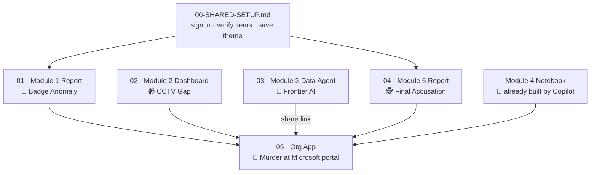

# 🔪 Murder at Microsoft — Setup Guide Index

> *"The CEO of Microsoft is dead. It's Build — the most important conference of the year — and someone silenced him before he could reveal the frontier AI feature that would change everything. Four authorization codes stand between you and the killer. Assemble your team. Work the evidence. Unmask the murderer before the closing keynote."*

This folder is the **build team's** control room. It contains everything needed to assemble the *Murder at Microsoft* escape room on top of the Fabric items GitHub Copilot already created in the **next-bis-day-3** workspace.

The setup is **split into parallel workstreams** so up to five people can build simultaneously. Read your assigned file top to bottom.

---

## 📁 File Map

| File | What it builds | Owner role | Depends on |
|------|----------------|------------|------------|
| [00-SHARED-SETUP.md](00-SHARED-SETUP.md) | Sign-in, item verification, theme file | **Everyone** (read first) | — |
| [01-MODULE1-REPORT.md](01-MODULE1-REPORT.md) | 🔬 Module 1 — Badge Anomaly report | Player 1 (GitHub Copilot Player) or Player 2 (Power BI Player) | `00-SHARED-SETUP.md` |
| [02-MODULE2-DASHBOARD.md](02-MODULE2-DASHBOARD.md) | 📹 Module 2 — CCTV Gap dashboard | Player 3 (RTI Dashboard Creator) | none — runs in parallel |
| [03-MODULE3-DATA-AGENT.md](03-MODULE3-DATA-AGENT.md) | 🔮 Module 3 — "Frontier AI" Data Agent | Player 4 (Data Agent Owner) | none — runs in parallel |
| [04-MODULE5-REPORT.md](04-MODULE5-REPORT.md) | 🕵️ Module 5 — Final Accusation report | Player 1 (GitHub Copilot Player) or Player 2 (Power BI Player) | `00-SHARED-SETUP.md` |
| [05-ORGAPP.md](05-ORGAPP.md) | 🚨 The game portal (Org app) | Player 5 (OrgApp Creator) | 01, 02, 03, 04 all published + Data Agent link |

> 📓 **Module 4** (the *MurderAtMicrosoft Diagnostic* notebook) needs **no setup** — Copilot already built it. It's wired into the portal in [05-ORGAPP.md](05-ORGAPP.md).

---

## 👥 5-Person Team Split

- **Player 1 — GitHub Copilot Player:** Ran the build prompt. Owns [01-MODULE1-REPORT.md](01-MODULE1-REPORT.md) and [04-MODULE5-REPORT.md](04-MODULE5-REPORT.md) (the two Power BI reports).
- **Player 2 — Power BI Player (optional):** Can take either report (01 or 04) to parallelize the Power BI Desktop work.
- **Player 3 — RTI Dashboard Creator:** Owns [02-MODULE2-DASHBOARD.md](02-MODULE2-DASHBOARD.md). Browser only.
- **Player 4 — Data Agent Owner:** Owns [03-MODULE3-DATA-AGENT.md](03-MODULE3-DATA-AGENT.md). Browser only. **Must hand the Data Agent share link to Player 5.**
- **Player 5 — OrgApp Creator:** Owns [05-ORGAPP.md](05-ORGAPP.md). Assembles the final portal **after** everyone else publishes.

Solo builder? Do them in this order: `00` → `01` → `04` → `02` → `03` → `05`.

---

## 🔗 Dependency Diagram

`05-ORGAPP.md` **cannot** be finished until Modules 1, 2, 5 are published **and** the Module 3 **Data Agent shareable link** is in hand.

---

## ✅ Definition of Done

- [ ] All Copilot items verified present (see [00-SHARED-SETUP.md](00-SHARED-SETUP.md))
- [ ] 🔬 Module 1 report published — Green Room anomaly reveals **BADGE-4471**
- [ ] 📹 Module 2 dashboard published — the 13:10 gap reveals **CCTV-2058**
- [ ] 🔮 Module 3 Data Agent published + shared — conversation reveals **MODEL-7712**
- [ ] 📓 Module 4 notebook opens and reads cleanly — buried code is **CORE-9330**
- [ ] 🕵️ Module 5 report published — all four correct codes trigger **"🎉 CASE SOLVED"**
- [ ] 🚨 Org app published with all 5 modules wired
- [ ] A test player opened the app link and reached every module (Data Agent opens in a new tab)

When every box is checked, the case is ready to be solved. See [../ANSWER-KEY.md](../ANSWER-KEY.md) (admins only) for the solution and verification queries, and [../PLAY-GUIDE.md](../PLAY-GUIDE.md) for the spoiler-free player briefing.
